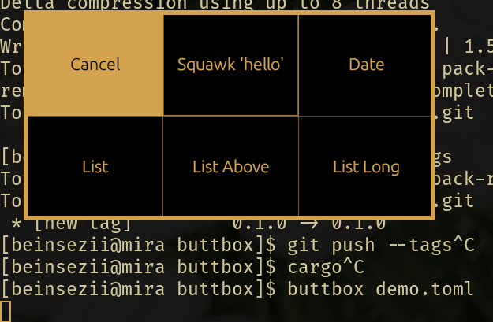

# ButtBox 0.2.1
Easily create a box of buttons to do things!

## Features
  * Make buttons that do things
    * Configure with [TOML](./demo.toml)
  * Pure Rust, very portable.

## WIP/Why this isn't 1.0 yet
  * Pipe the TOML?
  * Set commands from CLI?
  * ???
  
## Usage
See the [example TOML](./demo.toml)

## Installation
Manually compiled and tested binaries for Linux and Windows are provided on the [releases tab](https://github.com/Beinsezii/buttbox/releases)

Additionally, stable release binaries are automatically compiled and uploaded for Linux, Windows, and MacOS with the [Build Latest Release Tag Action](https://github.com/Beinsezii/buttbox/actions/workflows/build_release_tag.yml)
while the latest unstable binaries are can be found in the [Build Master Release Action](https://github.com/Beinsezii/buttbox/actions/workflows/build_release_master.yml)

Just pick the most recent (or otherwise) build of your choosing and download the artifact for your system. It'll arrive in a .zip file which you should be able to just unpack and run anywhere.

If you already have [Rust installed](https://rustup.rs/), you can build the latest release with

`cargo install --git https://github.com/Beinsezii/buttbox.git --tag 0.2.1`

You may omit the `--tag` flag if you follow the rebel path and want the latest possibly unstable build.

## F.A.Q.
Question|Answer
---|---
Why?|I already have a custom power menu, and when I decided to add a new button for rebooting straight into Windows using systemd-boot, I decided I should just make a dynamic button program instead of recompiling my other one every time I change something.
Someone's already thought of this!|Probably.
